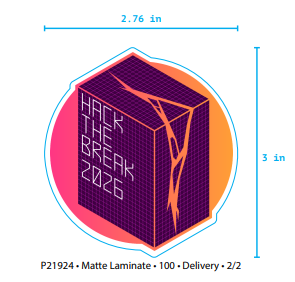
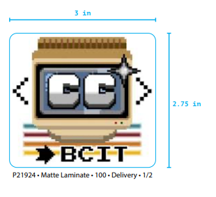
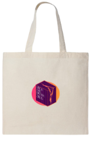
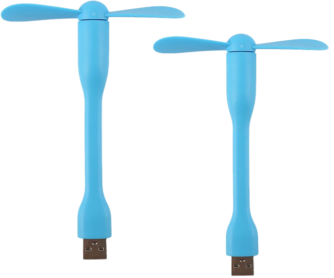

# Competition Details

Read on for important information about the competition, including prizes, judging criteria, and submission guidelines.

## Prizes

We have some amazing prizes lined up for the winners of HackTheBreak 2026, thanks to our generous sponsors! Our exact prize breakdown will be announced at opening ceremonies, but here's a sneak peek at what you can expect:

|  |  |
|:----------------------------------------------:|:----------------------------------------------:|
|  |  |
|  |  |

Along with these awesome swag prizes, we'll also have a cash prize for our first place winner, and further BCITSA merch prizes for all winners. We can't wait to see what you create and reward your hard work!

---

## Winner Categories

We will be awarding prizes in the following categories:

- **1st Place**: The best project overall, based on the judging criteria below.
- **2nd Place**: The second-best project overall.
- **Best Beginner Hack**: The best project created by a team comprised of &ge;50% first-semester students. 
- **Best Terminal Application**: The best project that is built for the terminal/command line interface.
- **Best Solo Hack**: The best project created by a solo participant.

---

## Theme

This year's theme is **Developer Tool**. We encourage you to build a project that helps developers be more productive, efficient, or creative. This could be a tool for code editing, debugging, deployment, collaboration, but it can also be something unproductive or fun (think VSCode Pets). The theme is meant to be a source of inspiration, not a strict requirement, so feel free to interpret it in your own way and build something that excites you!

## Restriction

This year's restriction is **Deployment**. Your project must be deployed and accessible to users in order to be eligible for judging. For this hackathon, we are defining deployed as "accessible to an end user". Deployment might look different for every project, from a web app hosted in the cloud to a terminal application with installation instructions. We encourage you to get creative with your deployment architecture and think about how users will interact with your project.

---

## Judging Criteria

Projects will be judged based on the following criteria:

1. **Innovation**: How creative and original is the project? Does it solve a unique problem or approach a common problem in a novel way?
2. **Technical Complexity**: How technically challenging is the project? Does it demonstrate a high level of skill and effort?
3. **Deployment Architecture**: How well is the project deployed? Is it accessible and functional for users?
4. **Presentation**: How well does the project presentation communicate the idea, features, and impact of the project? Is it clear and engaging?
5. **Impact**: What is the potential impact of the project? Does it have the potential to make a positive difference in the world or solve a significant problem?

!!! tip "Judges"
    Our judges are all technical professionals and BCIT alumni! They love to code, and are excited to hear about your technical solutions and architecture. Lean into the technical details of your project and be prepared to answer questions about your code, design decisions, and deployment architecture during the judging Q&A.

---

## Submission Guidelines

- Projects should include a clear description, screenshots or demo video, and any relevant links (e.g., GitHub repository).
- Projects must be built during the event timeframe (March 13-15, 2026).
- Projects should not violate any laws, terms of service, or BCIT policies.
- Plagiarism or academic misconduct will result in disqualification.
- Projects must be appropriate for all audiences (no NSFW or offensive content).

!!! warning "Project Submission Deadline"
    All projects must be submitted on **Devpost by Sunday at 11:00 AM**. Late submissions may not be considered for judging. Consider submitting your project early if you're ready to avoid any last-minute issues!

---

## Mini Challenges

Throughout the event, we will be hosting mini challenges with smaller prizes to keep things fun and engaging. These challenges will be announced on Discord during the event, so make sure you're active in the channel to participate!

Examples of previous mini challenges include:

- Fastest to deploy a project to the cloud
- Typeracer challenge
- CTF-style security challenge

---

## Collecting Your Prize
Winners will be announced during the closing ceremony on Sunday.

Mini Challenge winners will be announced during the event, but will receive their prizes at the closing ceremony along with the main competition winners.

!!! question "I won a prize but I am not able to attend the closing ceremony to receive it. What should I do?"
    If you're a winner and are unable to attend the closing ceremony, please reach out to an organizer in the Discord help channel as soon as possible so we can make arrangements for you to receive your prize.