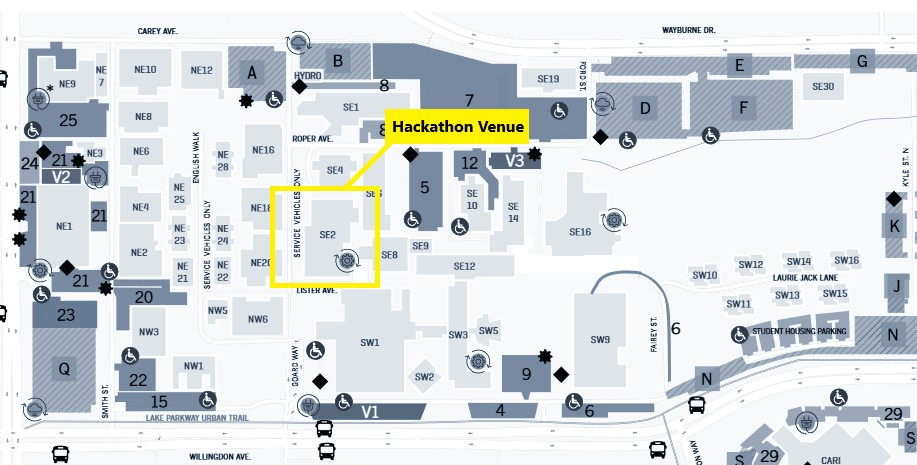
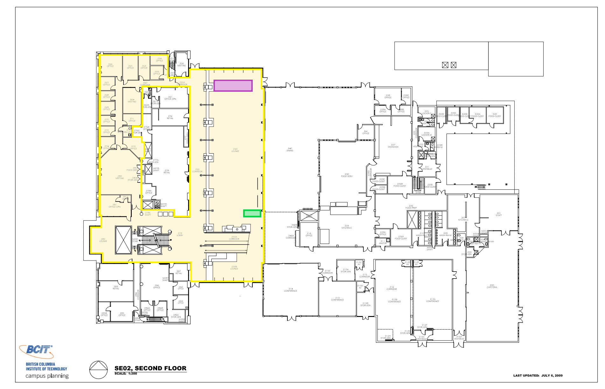
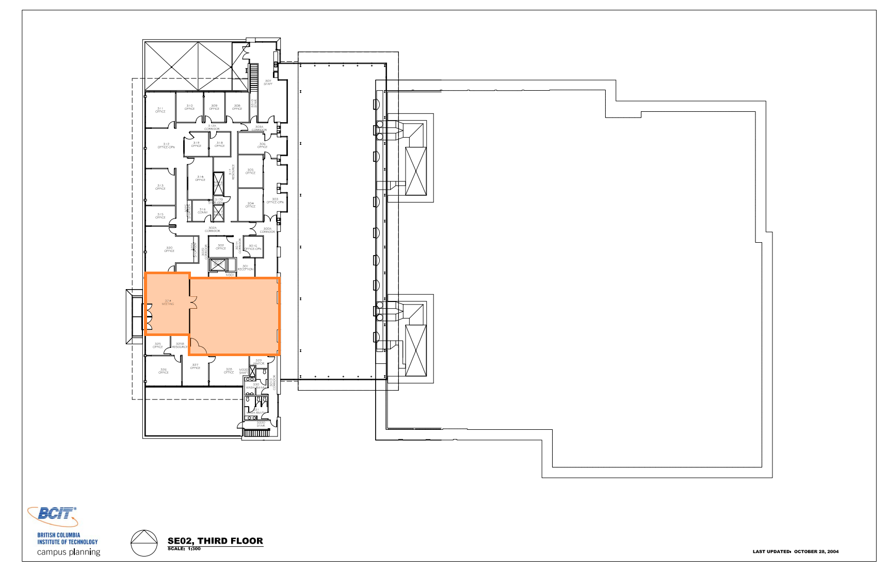
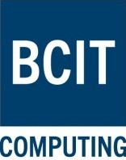
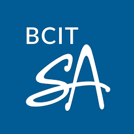
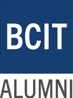
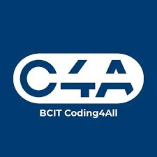
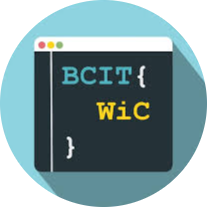

# Event Details

## Overview

- **Dates:** March 13 – March 15, 2026
- **Location:** BCIT Burnaby Campus, Building SE2 (Student Association Building)
- **Participants:** Exclusive to BCIT Students and Alumni
- **Team Size:** 1–4 members, up to 5 hackers if at least one is a first-semester student
- **Cost:** 100% free for all participants

!!! tip "First Time at a Hackathon?"
    Don’t worry if you’ve never attended a hackathon before! Beginners are welcome, and mentors will be available throughout the event to help you get started. HTB will also have workshops covering various topics to help you learn new skills and technologies. We even have a best beginner hack prize to encourage new hackers to participate!

---

## Schedule
HackTheBreak kicks off on Friday evening with an opening ceremony where we’ll introduce the event, go over the schedule, and help you get settled in. The hacking period will run through the weekend, with mentor sessions available to support you along the way. On Sunday, we’ll have a submission deadline followed by judging and a closing ceremony where we’ll announce the winners.

### Friday Schedule

| Start Time | End Time | Description |
|:----------:|:--------:|-------------|
| 5:00 PM | 6:00 PM | Hacker Check-In |
| 6:00 PM | 6:30 PM | Opening Ceremonies |
| 6:30 PM | 7:00 PM | Dinner Served |
| 7:00 PM | 9:00 PM | Mentors Available |
| 9:00 PM | --- | Building Closes |

### Saturday Schedule

| Start Time | End Time | Description |
|:----------:|:--------:|-------------|
| 6:00 AM | --- | Building Opens |
| 10:00 AM | 10:00 PM | Mentors Available |
| 12:00 PM | 1:00 PM | Lunch Served |
| 6:00 PM | 7:00 PM | Dinner Served |
| 10:00 PM | 6:00 AM | Building Locks (No Re-entry) |

### Sunday Schedule

| Start Time | End Time | Description |
|:----------:|:--------:|-------------|
| 7:00 AM | 8:00 AM | Breakfast Served |
| 10:00 AM | 11:00 AM | Mentors Available |
| 11:00 AM | --- | Project Submission Deadline |
| 11:30 AM | 1:00 PM | Judging Window |
| 1:00 PM | 1:30 PM | Lunch Served |
| 1:30 PM | 2:30 PM | Closing Ceremony & Awards |

!!! warning "Project Submission Deadline"
    All projects must be submitted on **Devpost by Sunday at 11:00 AM**. Late submissions may not be considered for judging.

---

## Location

**BCIT Burnaby Campus - SE2 (Student Association Building)**  
3700 Willingdon Ave,
Burnaby, BC V5G 3H2

!!! tip "Feeling Lost?"
    If you have trouble finding the venue, ask in the **Discord help channel** and an organizer will assist you.

### Campus Map

### Second Floor Event Space

- Yellow: Main event space for hacking, workshops, and mentor sessions
- Purple: Organizer office
- Green: Check-in area and information desk during opening ceremony

### Third Floor Event Space

- Orange: Food and lounge area

---

## Team Formation
You can participate solo or in teams of up to 4 people (up to 5 if at least one member is a first-semester student). 

!!! tip "No Team? No Problem"
    Many participants form teams at the event. Feel free to join others or build something solo. If you’re looking for teammates, you can attend collaborative workshops, use the **team formation channel in Discord**, or join the team formation session during the opening ceremony to meet other participants looking for teammates.

---

## Check-In Instructions

Participants must check in before beginning the event.

**Check-In Location:** SE2 Building, Great Hall (Second Floor)
**Check-In Time:** Friday, 5:00 PM – 6:00 PM

During check-in you will:

1. Confirm your registration
2. Receive your event badge
3. Get information about the venue and schedule

!!! warning "Bring Your Student ID"
    You may be asked to present **student identification** during check-in.

Going to miss check-in? Don’t worry! You can check in virtually by completing a Google Form that will be sent out to registered participants (more information on this process TBA Friday, March 13th). However, we highly encourage in-person check-in to get all the information and materials you need for the event. 

---

## WiFi Information

Please connect to the following WiFi network to access the internet during the event:

**Network:** eduroam or BCIT-Secure  
**Authentication:** Use your BCIT email and password

---

## Emergency Contacts
In case of a non medical emergency, please contact:

- **Event Organizer (Arman Chinai):** `@armanchinai` on Discord or in person
- **Campus Security:** 604-451-6856

**For medical emergencies, please call 911 immediately.**

---

## Sponsors & Partners

HackTheBreak is made possible thanks to the support of our sponsors.

|  |  |  |
|:--------------------------------------:|:--------------------------------------:|:--------------------------------------:|
|  |  |  |
|  |  |  |

---

## Organizers

HackTheBreak is organized by the **BCIT Computing Club**.

| Bhavnoor Saroya (President) | Arman Chinai (Vice President) |
|:--------------------------------------:|:--------------------------------------:|
|  |  |

---

!!! info "Need Help?"
    If you have questions during the hackathon, the fastest way to get help is through **Discord**. Feel free to send any inqueries to `@armanchinai`, or ask for an organizer in person.